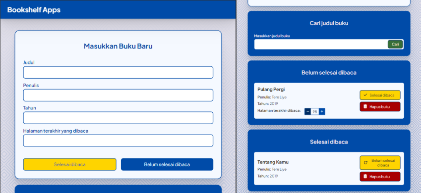

# Bookshelf App

Bookshelf App adalah aplikasi web sederhana yang memungkinkan pengguna untuk mengelola daftar buku yang mereka baca. Pengguna dapat menambahkan buku baru ke dalam daftar, menandai buku sebagai selesai dibaca, menghapus buku, dan mencari buku berdasarkan judul.

## Fitur

- **Menambahkan buku baru:**
  Pengguna dapat memas  ukkan judul, penulis, tahun terbit, dan halaman terakhir yang dibaca dari buku yang ingin ditambahkan.

- **Menandai buku sebagai "selesai dibaca":**
  Pengguna dapat menandai buku yang sudah selesai dibaca sehingga buku tersebut akan dipindahkan ke dalam daftar buku yang telah selesai dibaca. 

- **Menandai buku sebagai "belum selesai dibaca":**
  Pengguna dapat memindahkan kembali buku yang telah selesai dibaca ke dalam daftar buku yang belum selesai dibaca.

- **Mengubah halaman terakhir yang telah dibaca:**
  Saat pengguna belum menandai bukunya dengan "selesai dibaca", pengguna dapat mengubah penanda halaman terakhir yang dibacanya dan menyimpan datanya.

- **Menghapus buku:**
  Pengguna dapat memilih dan menghapus buku dari daftar buku yang mereka miliki.

- **Mencari buku:**
  Pengguna dapat mencari buku yang mereka punya berdasarkan judul.

- **Reset pencarian judul:**
  Pengguna dapat mengosongkan input pencarian judul dengan hanya menekan satu tombol.

- **Local storage:**
  Data buku yang telah dimasukkan pengguna akan tersimpan pada local storage, sehingga data buku tidak akan hilang kecuali disengaja.

## Teknologi yang Digunakan

- HTML
- CSS
- JavaScript